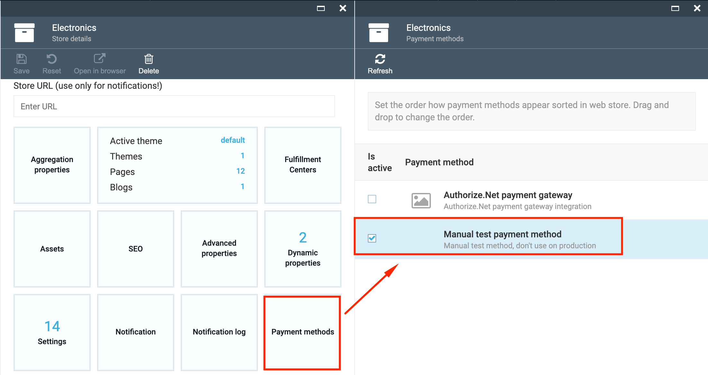
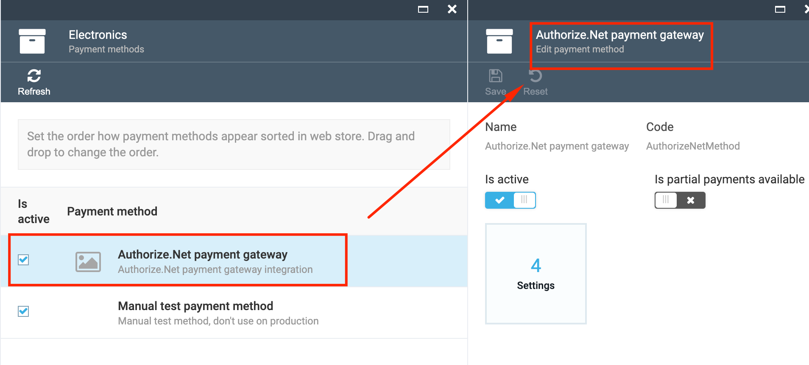
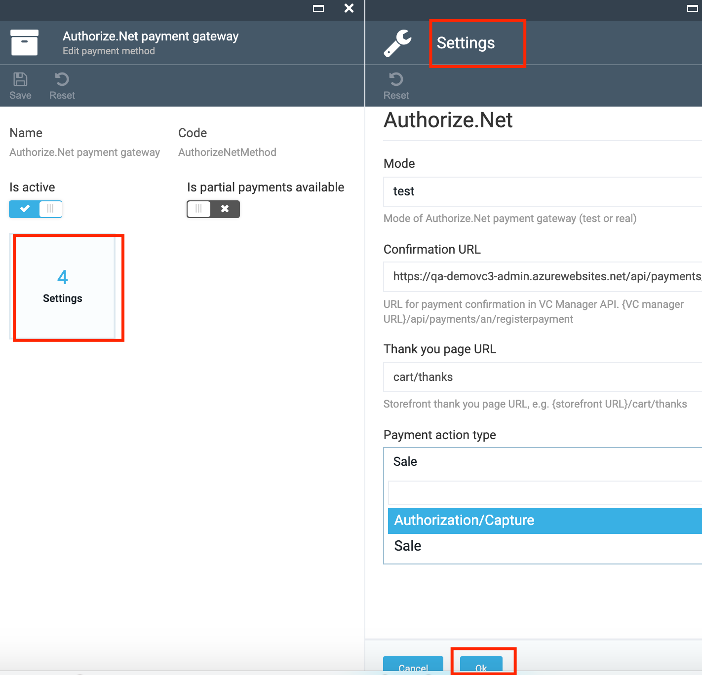

# vc-module-payment

## Overview

The Payment module allows the following options:

1. Register payment methods using the code;
1. Receive the list of payment methods on UI in VC admin;
1. Edit payment method settings;
1. Connect the payment methods to a Store.
1. The selected payment methods will be available for selection on the Storefront.

## Scenarios

### View Payment methods

1. Go to More->Stores-> select a Store;
1. In the opened Store details blade select the 'Payment methods' widget;
1. The registered payment methods will be displayed on 'Payment methods' blade;

### Edit Payment Method

1. Select a Payment method from the list on 'Payment methods' blade
1. On 'Edit Payment method' blade you can edit the following parameters:

     1. Activate or de-activate the Payment method using the 'Is Active' button;
     1. Make partial payments available for clients on the Storefront by switching on the 'Is partial payments available' button;
1. Once the editing is finished, save the changes made;
1. All changes made in VC admin will be displayed on the Storefront.

### Edit Settings

1. Select the 'Settings' widget on 'Edit payment method' blade;
1. The following settings can be edited: 

     1. Mode- you can select the option you need from the drop down list;
     1. Confirmation URL
     1. Thank you page URL
     1. Payment action type:

         1. Authorization/Capture
         1. Sale
1. Save the changes if you have edited the payment method settings.

## Documentation 

[Transaction types](https://support.authorize.net/s/article/What-Are-the-Transaction-Types-That-Can-Be-Submitted)

[Payment transactions](https://developer.authorize.net/api/reference/features/payment_transactions.html)